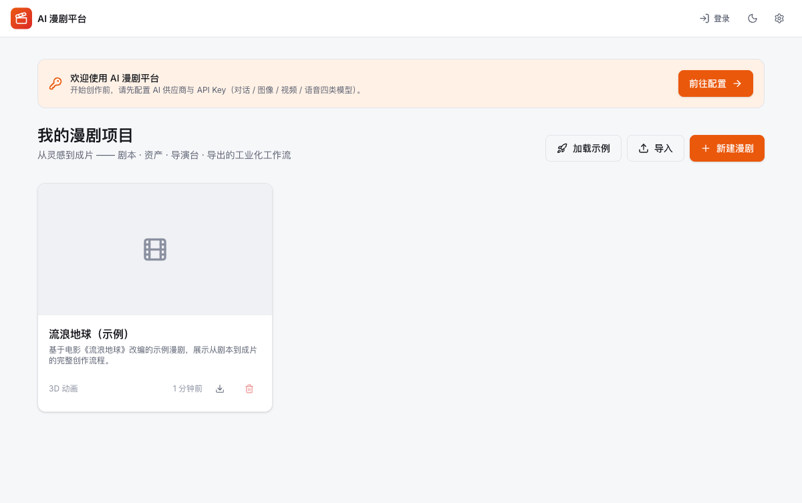
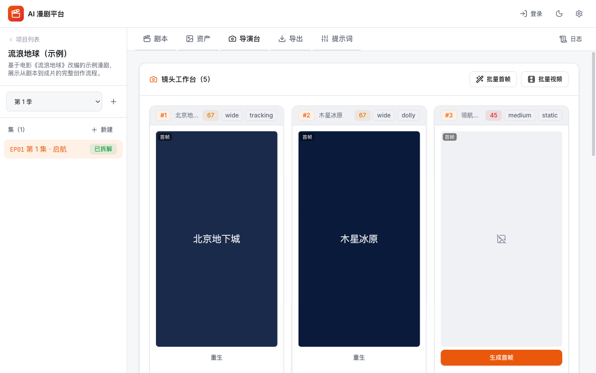
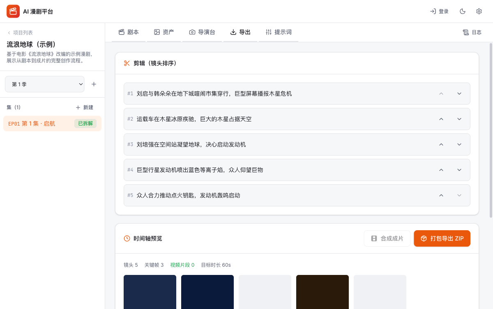
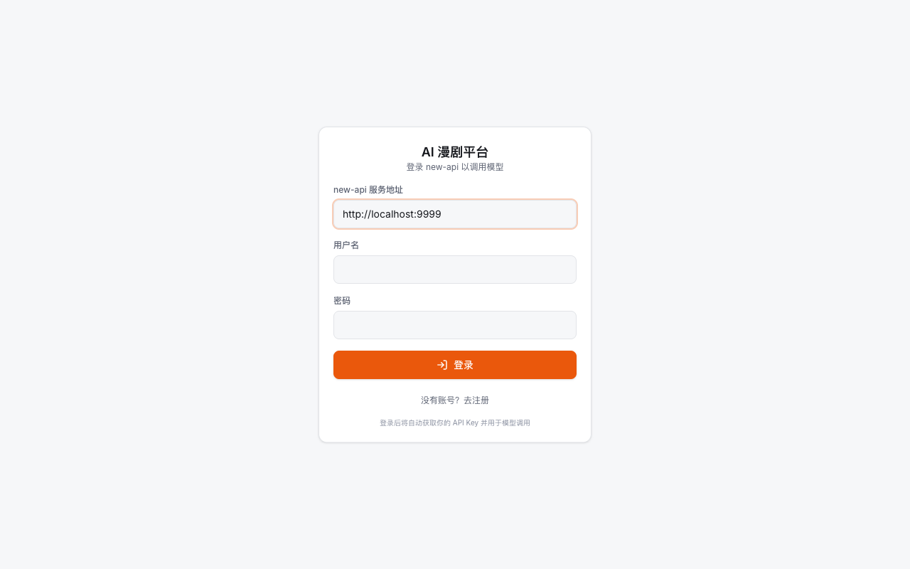

[简体中文](README.md) | [English](README.en.md)

# AI Manju (AI Comic Series Platform)

> 🎬 An all-in-one **industrial AI comic-series creation platform** — from a single story idea to a finished film. Keyframe-driven · multi-episode asset consistency · compatible with mainstream models · fully localized data.

[](https://react.dev/)
[](https://www.typescriptlang.org/)
[](https://vite.dev/)
[](https://tailwindcss.com/)
[]()
[]
[](#-license)

## Introduction

An AI comic-series (manhua-drama) generation platform with [new-api](https://github.com/QuantumNous/new-api) as the backend gateway. Built for creators, it delivers a complete industrial workflow: **Script → Assets → Director's Desk → Export**.

Instead of uncontrollable "gacha-style" generation, it follows a **Script-to-Asset-to-Keyframe** pipeline: precise start and end frames are generated first, then a video model (Seedance / Sora / Veo) interpolates between them. Every shot is strongly constrained by "character reference sheets + scene concept art", and an AI-generated global art-direction document is injected into all prompts to keep the visual style consistent. All data stays local (IndexedDB + OPFS), with project-style management for **multi-episode series**.

## 🖼️ Screenshots

| Dashboard (project management) | Director's Desk (shot work cards) |
|---|---|
|  |  |

| Export (editing + timeline + final cut) | Login (via new-api) |
|---|---|
|  |  |

> Screenshots come from the built-in "The Wandering Earth" demo project — click "Load Example" on the home page to try the full workflow.

## ✨ Features

- **Script & storyboard**: AI breaks a novel / outline down into characters, scenes, props, story beats, and art direction; shot sequences (framing / camera moves / cast) planned automatically from beats and target duration; script continuation / rewriting and multimodal style inference from a reference image
- **Assets & casting**: character reference sheets + wardrobe system (multiple outfits) + 9-pose character turnarounds; scene concept art, prop consistency references, user-supplied reference images, one-click batch generation
- **Director's workbench**: per-shot work cards with independent start frame / end frame / video / dubbing; first-last frame interpolation for video (Seedance/Sora use the start frame only, Veo supports both — adapted automatically); nine-grid composition aids, narration/dialog TTS, batch generation
- **Export**: timeline preview; ZIP bundles (assets + `storyboard.json`); in-browser muxing via canvas + MediaRecorder + AudioContext into a single WebM final cut
- **Multi-episode & data**: Project → Season → Episode management; project-level asset library versioning + cross-episode sync banner; new episodes automatically reuse same-named assets (Jaccard + Dice similarity); OPFS video storage to avoid IndexedDB capacity limits; project JSON import / export
- **Models & controllability**: one-click presets for 9 providers; chat / image / video / audio models switch independently; prompt templates with 32 camera-move references, render logs, 5-factor weighted quality scoring, prompt linting / version rollback / LLM compression

## 🛠 Tech Stack

| Layer | Technology |
| --- | --- |
| Framework / build | React 19 + TypeScript 5.8 / Vite 6 (manualChunks splitting) |
| Styling / routing | Tailwind CSS v4 (industrial dark/light themes) / React Router 7 |
| Storage | IndexedDB (`idb`) + OPFS (large video objects) |
| Backend / testing / i18n | new-api (AI gateway, same-origin reverse proxy via Docker) / Vitest (service-layer unit tests) / full Chinese-English dictionaries (`I18nContext`) |

## 🚀 Quick Start

```bash
git clone <repo-url> && cd ai-manju
npm install       # requires Node.js >= 18
npm run dev        # Dev server at http://localhost:3000
npm run build      # Type check + production build
npm run typecheck  # TypeScript type check
```

### Docker Deployment (recommended for production)

`docker-compose.yaml` bundles new-api out of the box; the frontend nginx reverse-proxies `/api` + `/v1` to new-api, and the same-origin setup avoids cross-site cookie issues:

```bash
docker compose up -d --build                   # Frontend at http://localhost:8080; new-api internal only
docker compose --profile proxy up -d --build   # Optional: media proxy (bypasses CORS on signed URLs)
docker compose --profile mysql up -d --build   # Optional: MySQL instead of new-api's default SQLite
```

On first visit, enter the **same-origin address** (e.g. `http://localhost:8080`) as the new-api URL on the login page. For production, switch `8080:80` to `443:80` + TLS; new-api persists data under `./data/new-api`, and `SESSION_SECRET` should be changed to a random value.

### Integrating with new-api

All **model requests, user login, and token management** go through the new-api gateway (OpenAI-compatible + user system): start the bundled new-api and register the first account (becomes admin automatically) → add AI providers (OpenAI / Volcano Doubao / Gemini, etc.) under new-api's "Channels" → enter the new-api address and credentials on this platform's login page → pick or create an API token under "Model Config"; it is then used for all model calls.

Integration mechanism (per the official new-api API): login `POST /api/user/login` → access token via `GET /api/user/token`; user/token/model endpoints such as `/api/user/self` and `/api/token/`; model calls via OpenAI-compatible `/v1/*` with `Authorization: Bearer sk-xxx`.

### Model Compatibility & Deployment

Primarily the OpenAI-compatible protocol, plus native Gemini and ByteDance Volcano, with built-in presets for 9 providers: OpenAI, Volcano Engine/Doubao (Seedream images / Seedance video), Google Gemini (native images / Veo video), DeepSeek, Moonshot Kimi, Zhipu GLM, Alibaba Tongyi, SiliconFlow, and AntSK.

The repo ships with `.github/workflows/deploy.yml`; pushing to `main` deploys automatically to GitHub Pages at `https://<username>.github.io/<repo-name>/` (Settings → Pages → Source: "GitHub Actions"; SPA routing falls back via `404.html`). Vercel / Netlify / Cloudflare Pages also work with zero configuration.

## ⚙️ Configuration & Environment Variables

Copy `.env.example` to `.env`; the optional setting is the media proxy endpoint (bypasses CORS restrictions on signed URLs): `VITE_MEDIA_PROXY_ENDPOINT=http://localhost:3001/api/media-proxy`.

When video/image signed URLs cannot be downloaded directly due to CORS, start the proxy: `node server/mediaProxyServer.mjs` (port 3001 by default; GET only, 200MB / 60s limits).

## 📁 Project Structure

```text
ai-manju/
├── src/
│   ├── types/                 # Domain models (multi-episode, assets, shots, model config)
│   ├── services/adapters/     # Script / asset / director / export / prompt services + AI adapters
│   ├── contexts/              # Model / Project / Theme / Auth / I18n state
│   └── components/stages/     # Five-stage workflow (Script/Assets/Director/Export/Prompts)
├── server/mediaProxyServer.mjs  # Optional media proxy
├── nginx.conf / docker-compose.yaml  # SPA fallback + same-origin new-api reverse proxy / one-command deploy
```

## 📚 Project Docs

- [`docs/功能对比与开发计划.md`](./docs/功能对比与开发计划.md) — module-by-module comparison with the reference project + full roadmap
- [`docs/实现完成报告.md`](./docs/实现完成报告.md) — implementation completeness and test report
- [`docs/开发计划.md`](./docs/开发计划.md) — early development plan

## 🔗 Related Projects

- [ComfyStudio (new-aigc-comfyui-minimax-h3)](https://github.com/hequan2017/new-aigc-comfyui-minimax-h3) — the same author's ComfyUI multi-GPU management platform with a built-in AI comic-series workbench (episodic scripts → storyboards → scene videos → merged final cut).

## 📄 License

This project is released under the **MIT** License.

The architecture and workflow concepts are inspired by [**BigBanana-AI-Director**](https://github.com/shuyu-labs/BigBanana-AI-Director) (Script-to-Asset-to-Keyframe pipeline, keyframe-driven generation, multi-episode architecture). This project is an **independent implementation** and copies none of its source code (the reference project is CC BY-NC-SA 4.0).
