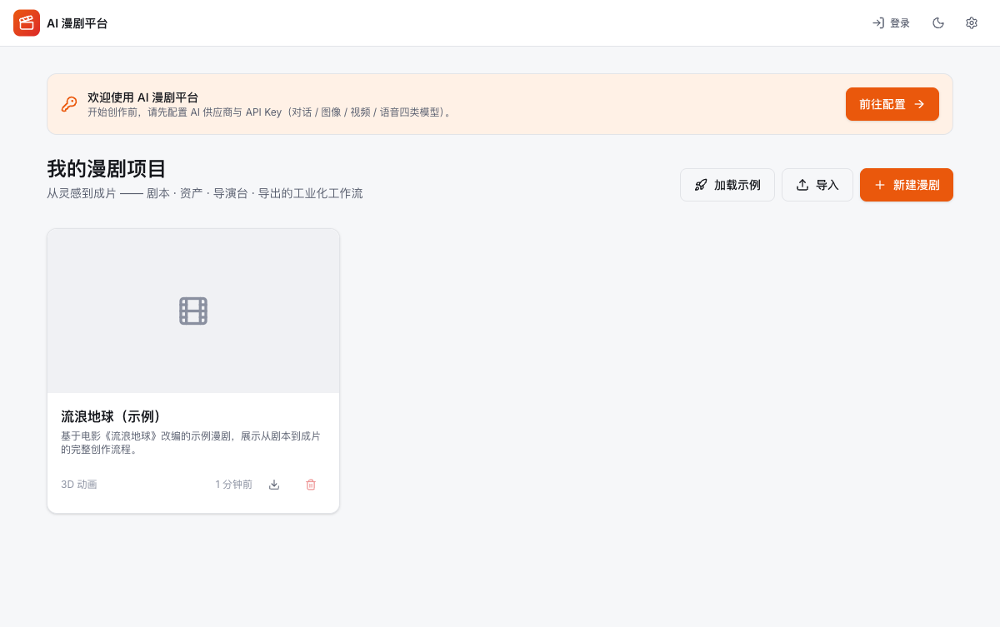
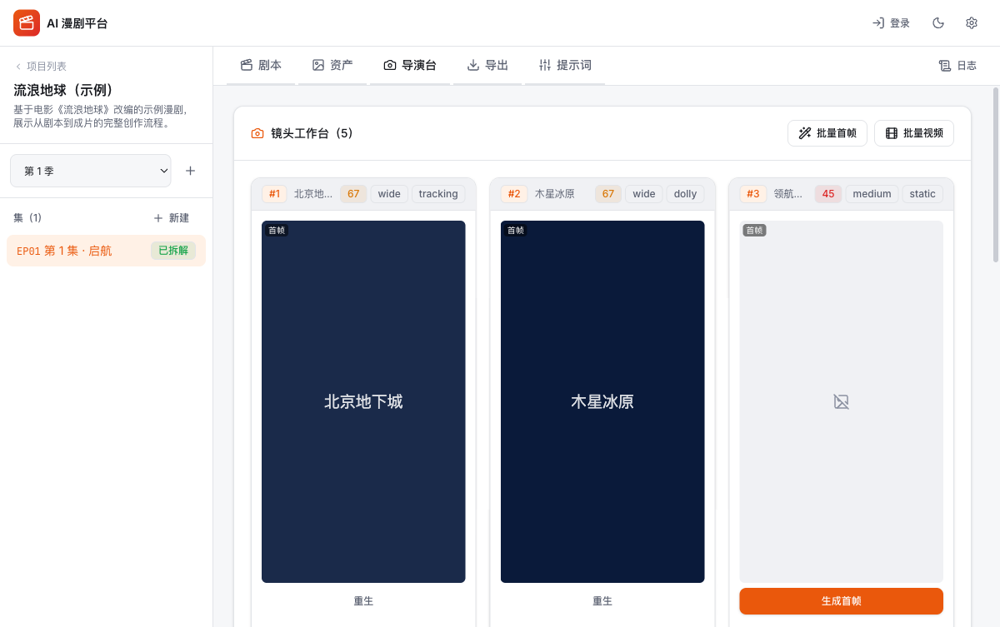
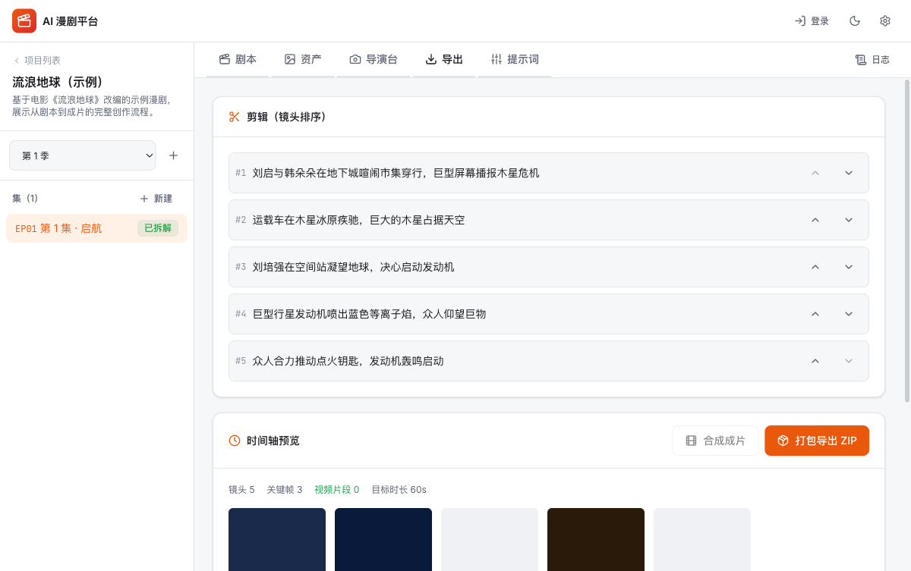
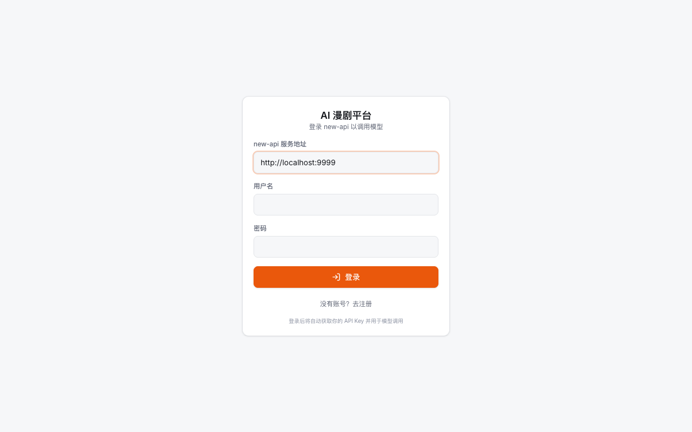

# AI 漫剧平台（AI Manju）

> 🎬 一站式 **AI 漫剧工业化创作平台** —— 从一句故事到完整成片。
> 关键帧驱动 · 多集资产一致 · 主流模型全兼容 · 全流程本地化。

[](https://react.dev/)
[](https://www.typescriptlang.org/)
[](https://vite.dev/)
[](https://tailwindcss.com/)
[](#-许可证)

**AI 漫剧平台** 面向创作者，实现「**剧本 → 资产 → 导演台 → 导出**」的完整工业化工作流。它摒弃不可控的"抽卡式"生成，采用 **Script-to-Asset-to-Keyframe** 流程，精准控制角色一致性、场景连续性与镜头运动，并原生支持**多集漫剧**的项目化管理。

---

## 📑 目录

- [核心理念](#-核心理念)
- [核心特性](#-核心特性)
- [技术架构](#-技术架构)
- [多集数据模型](#-多集数据模型)
- [快速开始](#-快速开始)
- [使用指南](#-使用指南)
- [AI 模型兼容](#-ai-模型兼容)
- [配置与环境变量](#-配置与环境变量)
- [开发脚本](#-开发脚本)
- [功能矩阵](#-功能矩阵)
- [项目文档](#-项目文档)
- [设计原则](#-设计原则)
- [路线图](#-路线图)
- [FAQ](#-faq)
- [致谢与许可证](#-致谢与许可证)

---

## 🧠 核心理念

### 关键帧驱动（Keyframe-Driven）

传统 Text-to-Video 难以精确控制运镜与起止画面。本平台引入动画制作的**关键帧**概念：

1. **先画后动**：先生成精准的起始帧（Start Frame）与结束帧（End Frame）。
2. **插值生成**：在两帧之间用视频模型（Seedance / Sora / Veo）生成平滑过渡。
3. **资产约束**：所有画面受「角色定妆照 + 场景概念图」强约束，杜绝人物变形与串戏。
4. **美术指导统一**：AI 先产出全局美术指导文档（Art Direction），注入所有提示词，保证全片风格一致。

### 多集资产一致性

同一部漫剧的多集之间，角色 / 场景 / 道具由**项目级资产库**统一管理。任一集更新资产后，其他集通过**同步横幅**一键拉取最新，保证跨集视觉统一。

---

## 🖼️ 界面预览

| Dashboard（项目管理） | 导演台（镜头工作卡） |
|---|---|
|  |  |

| 导出（剪辑 + 时间轴 + 成片） | 登录（对接 new-api） |
|---|---|
|  |  |

> 截图来自内置「流浪地球」示例项目——首页点击「加载示例」即可体验完整流程（剧本 → 资产 → 导演台 → 导出）。示例项目不可删除，可随时重新加载。

## ✨ 核心特性

### 📖 剧本与分镜
- **智能剧本拆解**：输入小说 / 大纲，AI 自动拆解为角色、场景、道具、故事节拍、美术指导。
- **分镜规划**：基于节拍与目标时长自动规划镜头序列（景别 / 运镜 / 出场角色）。
- **剧本续写 / 改写**：按指令续写或改写故事（保持人设风格）。
- **图推断风格**：上传参考图，AI 多模态分析视觉风格。

### 🎭 资产与选角
- **角色定妆**：生成标准参考图，**衣橱系统**支持多套造型（日常 / 战斗 / 受伤）。
- **角色九宫格**（Turnaround）：9 视角多面参考，强化角色一致性。
- **场景概念**：生成环境参考图，保证同场景光影统一。
- **道具一致性**：跨镜头物品视觉统一。
- **参考图上传**：支持用户自带定妆图 / 概念图。
- **批量生成**：一键生成全部角色 / 场景 / 道具。

### 🎬 导演工作台
- **镜头工作卡**：每镜头独立的首帧 / 尾帧 / 视频 / 配音。
- **关键帧驱动**：首帧 / 尾帧生成，视频首尾帧插值。
- **九宫格构图**：单镜头拆为多视角，辅助首帧构图选型。
- **镜头配音**：旁白 / 对白 TTS，支持音频播放。
- **批量操作**：批量生成首帧、批量生成视频。
- **智能模型适配**：根据视频模型类型自动启用 / 隐藏尾帧（Seedance/Sora 仅首帧，Veo 支持首尾帧）。

### 🎞️ 成片导出
- **时间轴预览**：镜头缩略图 + 视频片段 + 配音。
- **ZIP 打包导出**：所有关键帧 / 视频片段 / 配音 + `storyboard.json` 元数据。
- **浏览器内混流**：canvas + MediaRecorder + AudioContext 合成单一 WebM 成片。

### 🗂️ 多集与数据
- **项目 → 季 → 集**三级管理。
- **跨集资产同步**：资产库版本机制 + 同步横幅。
- **AI 资产匹配**：新集拆解时自动复用同名库资产（Jaccard + Dice 相似度）。
- **OPFS 视频存储**：大视频移出 IndexedDB，规避容量上限。
- **项目导入 / 导出**：整项目 JSON 备份与迁移。

### 🎛️ 模型与可控性
- **主流模型预设**：9 家供应商一键添加。
- **四类模型**：对话 / 图像（文生图 + 图生图）/ 视频 / 语音，独立切换。
- **提示词模板系统**：32 种运镜参考 + 可编辑模板。
- **渲染日志面板**：记录每次 AI 调用的成败 / 耗时 / 模型。
- **质量评估**：5 项加权镜头质量评分。
- **提示词预检 / 版本回滚 / LLM 压缩**。

---

## 🏗️ 技术架构

纯前端 SPA（无后端依赖，数据本地化、隐私安全），可选 Node 媒体代理。

| 层级 | 技术选型 |
| --- | --- |
| 框架 | React 19 + TypeScript 5.8 |
| 构建 | Vite 6 |
| 样式 | Tailwind CSS v4（工业风明暗双主题，CSS 变量驱动） |
| 路由 | React Router 7 |
| 存储 | IndexedDB（`idb` 封装）+ OPFS（视频大对象） |
| 打包 | JSZip（成片导出） |
| 图标 | lucide-react |
| 媒体代理 | Node HTTP 服务（可选） |

### 目录结构

```
ai-manju/
├── src/
│   ├── types/                 # 领域模型（多集架构、资产、镜头、模型配置）
│   ├── services/
│   │   ├── adapters/          # AI 适配器（chat/image/video/audio + http）
│   │   ├── ai 服务（暂直接放 services 根）：
│   │   ├── scriptService.ts        # 剧本拆解 + 镜头 + 续写/改写/图推断/指纹
│   │   ├── shotService.ts          # 九宫格分镜
│   │   ├── shotActions.ts          # 镜头操作纯函数（首/尾帧/视频/配音）
│   │   ├── visualService.ts        # 美术指导 / 批量角色 / 角色九宫格
│   │   ├── assetService.ts         # 资产参考图生成
│   │   ├── assetMatchService.ts    # AI 资产相似度匹配
│   │   ├── assetLibraryService.ts  # 资产库 CRUD + 提升入库
│   │   ├── characterSyncService.ts # 跨集资产同步
│   │   ├── modelService.ts         # 模型配置管理
│   │   ├── modelPresets.ts         # 主流模型预设
│   │   ├── promptTemplateService.ts# 提示词模板 + 运镜参考
│   │   ├── promptLintService.ts    # 提示词预检
│   │   ├── promptVersionService.ts # 提示词版本历史
│   │   ├── promptCompressionService.ts # LLM 压缩
│   │   ├── qualityAssessmentService.ts # 质量评估
│   │   ├── renderLogService.ts     # 渲染日志
│   │   ├── exportService.ts        # canvas 混流成片
│   │   ├── transferService.ts      # 项目导入导出
│   │   ├── videoStorageService.ts  # OPFS 视频存储
│   │   ├── mediaFetchService.ts    # CORS 代理回退
│   │   ├── db.ts / factory.ts / utils.ts
│   ├── contexts/              # Model / Project / Theme / Alert 状态
│   ├── hooks/                 # useShotActions / useVideoSrc
│   ├── components/
│   │   ├── ui/                # 通用 UI 组件库
│   │   ├── stages/            # 五阶段工作流（Script/Assets/Director/Export/Prompts）
│   │   ├── Dashboard / Settings / Workspace / TopBar
│   │   ├── Onboarding / WardrobeModal / RenderLogsModal / AssetSyncBanner
│   ├── App.tsx / main.tsx / index.css
├── server/
│   └── mediaProxyServer.mjs   # 可选媒体代理
├── docs/                      # 开发计划 / 功能对比 / 实现报告
└── package.json
```

---

## 🌳 多集数据模型

```
ManjuProject（漫剧项目）
  ├── visualStyle / language / artDirection
  ├── characterLibrary / sceneLibrary / propLibrary   ← 项目级共享资产库（跨集一致，version 单调递增）
  └── Season（季）
        └── Episode（集，创作单元）
              ├── rawScript → scriptData
              │     ├── characters[] / scenes[] / props[]   ← 含 libraryId/libraryVersion
              │     ├── storyBeats[]
              │     └── artDirection
              ├── characterRefs / sceneRefs / propRefs      ← 同步引用（syncedVersion / syncStatus）
              ├── shots[]
              │     └── keyframes[start/end] → interval(视频) → dubbing(配音) → nineGrid
              └── renderLogs[]
```

---

## 🚀 快速开始

### 环境要求

- Node.js ≥ 18
- npm（或 pnpm / yarn）

### 安装与启动

```bash
# 1. 克隆项目
git clone <repo-url>
cd ai-manju

# 2. 安装依赖
npm install

# 3. 启动开发服务器
npm run dev
# → 浏览器打开 http://localhost:3000

# 4. 生产构建
npm run build

# 5. 预览生产构建
npm run preview

# 6. 类型检查
npm run typecheck
```

### Docker 部署（推荐生产）

```bash
# 方式一：docker compose（推荐）
docker compose up -d --build
# → 浏览器打开 http://localhost:8080

# 方式二：仅前端镜像
docker build -t ai-manju .
docker run -d -p 8080:80 --name ai-manju ai-manju

# 启用媒体代理（绕过签名 URL 的 CORS，可选）
docker compose --profile proxy up -d --build

# 查看日志 / 停止
docker compose logs -f
docker compose down
```

> 生产环境建议构建时注入媒体代理端点：
> `docker compose build --build-arg VITE_MEDIA_PROXY_ENDPOINT=https://your-proxy/api/media-proxy`

**一键完整启动（前端 + new-api 后端）**：`docker-compose.yaml` 已内置 new-api 服务，`docker compose up -d --build` 同时启动：
- 前端平台：http://localhost:8080
- new-api 后端：http://localhost:3000（首次访问需注册首个账号，自动成为管理员）

可选附加：`docker compose --profile proxy up -d`（媒体代理）、`--profile mysql up -d`（MySQL 替代 SQLite）。

### 后端 new-api 部署与对接

本平台所有**模型请求、用户登录、令牌管理**均通过 **new-api** 网关（OpenAI 兼容 + 用户系统）：

| 步骤 | 操作 |
|---|---|
| 1. 启动 new-api | `docker compose up -d`（已含 new-api），或独立部署 new-api |
| 2. 初始化 | 访问 http://localhost:3000，注册首个账号（自动管理员） |
| 3. 配置渠道 | new-api 后台「渠道」添加 AI 供应商（OpenAI / 火山豆包 / Gemini 等）并设置模型 |
| 4. 平台登录 | 本平台登录页填写 new-api 地址（`http://localhost:3000`）+ 账号密码 |
| 5. 选用令牌 | 登录后「模型配置」→ new-api 账户卡片，选用/创建 API 令牌 → 自动用于所有模型调用 |

**对接机制**（已实现，按 new-api 官方 API）：
- 登录 `POST /api/user/login` → 换 access_token `GET /api/user/token`
- 用户/令牌/模型：`/api/user/self`、`/api/token/`、`POST /api/token/:id/key`（取明文拼 `sk-`）、`/api/user/models`
- 管理接口：`Authorization: <access_token>` + `New-Api-User: <id>` 头
- 模型调用：OpenAI 兼容 `/v1/*` + `Authorization: Bearer sk-xxx`

> new-api 数据持久化于 `./data/new-api`；`SESSION_SECRET` 请改为随机值；生产建议配 MySQL（`--profile mysql`）。

> 端口映射默认 `8080:80`（前端）、`3000:3000`（new-api），可在 `docker-compose.yaml` 修改。

### 首次使用

1. 打开 `http://localhost:3000`，首页会提示**配置模型**。
2. 点击「前往配置」，进入**模型配置**页。

---

## 📖 使用指南

### 第一步：配置 AI 模型

进入「模型配置」页（右上角 ⚙️）：

1. **添加供应商**：点击主流预设按钮（如「火山引擎(豆包)」「OpenAI」）一键添加，或手动「新增」。
2. **填写 API Key**：全局 Key 或供应商独立 Key。
3. **选择四类模型**：
   - **对话模型**：剧本分析 / 提示词生成（如 `gpt-4o-mini`）
   - **图像模型**：关键帧 / 定妆图（如 `gpt-image-1`、`gemini-2.5-flash-image`）
   - **视频模型**：帧间插值（如 `doubao-seedance-1-5-pro`）
   - **语音模型**：配音 TTS（如 `tts-1`）
4. **设置默认画面比例**：9:16（竖屏漫剧）/ 16:9 / 1:1。

### 第二步：创建漫剧项目

1. 首页点击「新建漫剧」。
2. 填写标题、简介，选择视觉风格（动漫 / 3D / 真人 / 油画 / 赛博朋克…）与语言。
3. 进入工作台（自动创建第一季）。

### 第三步：剧本阶段（Stage 1 · 剧本）

1. 在左侧「新建」一集。
2. 粘贴故事 / 小说 / 大纲文本。
3. 选择目标时长（30s / 60s / 90s / 3min / 5min）。
4. 点击「**AI 拆解剧本**」：
   - AI 生成角色、场景、道具、故事节拍、**美术指导**。
   - 自动规划分镜（镜头数、景别、运镜、出场角色）。
   - **自动匹配项目资产库**（同名复用）并**提升新资产入库**。
5. 可选：「**续写**」追加剧情、「**改写**」按指令修改。

### 第四步：资产阶段（Stage 2 · 资产）

1. 角色定妆 / 场景概念 / 道具参考三个分区。
2. **单个生成**或「**批量生成**」。
3. 可选：
   - 「**上传图片**」使用自带定妆图。
   - 角色「**造型**」打开**衣橱**，添加多套造型 + 九宫格多视角。
4. 若其他集更新了资产，顶部显示**同步横幅**，点击「同步全部」拉取最新。

### 第五步：导演台（Stage 3 · 导演台）

1. 镜头工作卡网格。
2. 每张卡片：
   - 「**生成首帧**」（场景 + 角色 + 动作联合驱动）。
   - 「**生成尾帧**」（仅 Veo 等支持首尾帧的模型显示）。
   - 「**生成视频**」（首帧 / 首尾帧插值，含轮询进度）。
   - 「**生成配音**」（旁白 / 对白）。
   - 「**生成九宫格**」（多视角构图参考）。
3. 顶部「**批量首帧**」「**批量视频**」。

### 第六步：导出（Stage 4 · 导出）

1. 时间轴预览所有镜头（关键帧 / 视频 / 配音）。
2. 「**打包导出 ZIP**」：所有素材 + `storyboard.json`。
3. 「**合成成片**」：浏览器内 canvas 混流为单一 WebM（需 MediaRecorder 支持）。

### 第七步：提示词管理（Stage 5 · 提示词）

- 查看 **32 种运镜参考库**（点击复制）。
- 编辑可复用模板（分镜系统提示词、关键帧引导词、视频前缀、负面提示词）。

---

## 🔌 AI 模型兼容

采用 **OpenAI 兼容协议**为主，兼容原生 Gemini 与字节火山。内置 9 家主流预设：

| 供应商 | Base URL | 能力 |
| --- | --- | --- |
| **OpenAI** | `api.openai.com` | GPT / DALL·E / Sora / TTS |
| **火山引擎(豆包)** | `ark.cn-beijing.volces.com` | 豆包对话 / Seedream 图像 / **Seedance 视频** |
| **Google Gemini** | `generativelanguage.googleapis.com` | Gemini 对话 / 图像(Gemini原生) / Veo 视频 |
| **DeepSeek** | `api.deepseek.com` | 深度推理对话 |
| **Moonshot Kimi** | `api.moonshot.cn` | 长上下文对话 |
| **智谱 GLM** | `open.bigmodel.cn` | GLM 对话 / CogView 图像 |
| **阿里通义** | `dashscope.aliyuncs.com` | 通义千问 / 万相图像 |
| **硅基流动** | `api.siliconflow.cn` | 开源模型聚合 |
| **AntSK 聚合** | `api.antsk.cn` | 多模型代理 |

### 协议支持

| 能力 | 协议 |
| --- | --- |
| 文生文（对话） | OpenAI `/v1/chat/completions` + 多模态（image_url） |
| 文生图 | OpenAI `/v1/images/generations` |
| 图生图 | OpenAI `/v1/images/edits`（multipart）/ Gemini `inlineData` |
| 视频生成 | **Seedance**（火山异步任务）/ **Sora**（OpenAI 异步）/ **Veo**（通用同步） |
| 语音合成 | OpenAI `/v1/audio/speech` |

供应商支持多 baseUrl + 独立 / 全局 API Key，四类模型可分别切换不同供应商。

---

## ⚙️ 配置与环境变量

复制 `.env.example` 为 `.env`：

```bash
# 可选：媒体代理服务器端点（绕过签名 URL 的 CORS 限制）
VITE_MEDIA_PROXY_ENDPOINT=http://localhost:3001/api/media-proxy
```

### 启动媒体代理（可选）

当视频 / 图像的签名 URL 因 CORS 无法直接下载时，启动代理：

```bash
node server/mediaProxyServer.mjs   # 默认端口 3001
```

代理会校验协议、限制大小（200MB）与超时（60s），仅放行 GET。

---

## 🛠️ 开发脚本

| 命令 | 说明 |
| --- | --- |
| `npm run dev` | 启动开发服务器（HMR，端口 3000） |
| `npm run build` | 类型检查 + 生产构建（输出 `dist/`） |
| `npm run preview` | 预览生产构建 |
| `npm run typecheck` | TypeScript 类型检查 |
| `node server/mediaProxyServer.mjs` | 启动媒体代理（端口 3001） |

---

## 📊 功能矩阵

对标参考项目的完整实现状态：

| 模块 | 功能 | 状态 |
| --- | --- | --- |
| **剧本** | AI 拆解（角色/场景/道具/节拍/美术指导） | ✅ |
| | 分镜规划 | ✅ |
| | 续写 / 改写 | ✅ |
| | 图推断风格（多模态） | ✅ |
| | 场景指纹缓存 | ✅ |
| **资产** | 角色定妆 / 场景概念 / 道具 | ✅ |
| | 衣橱系统（造型变体） | ✅ |
| | 角色九宫格（turnaround） | ✅ |
| | 参考图上传 | ✅ |
| | 批量生成 | ✅ |
| **导演台** | 首帧 / 尾帧生成 | ✅ |
| | 视频片段（Seedance/Sora/Veo） | ✅ |
| | 镜头配音 | ✅ |
| | 九宫格构图 | ✅ |
| | 批量首帧 / 批量视频 | ✅ |
| **导出** | 时间轴预览 | ✅ |
| | ZIP 打包 | ✅ |
| | canvas 混流成片 | ✅ |
| **多集** | 项目→季→集管理 | ✅ |
| | 跨集资产同步 | ✅ |
| | AI 资产匹配复用 | ✅ |
| | 项目导入 / 导出 | ✅ |
| | OPFS 视频存储 | ✅ |
| **模型** | 主流预设（9 家） | ✅ |
| | 四类模型独立切换 | ✅ |
| | 文生图 / 图生图 | ✅ |
| **可控性** | 提示词模板系统 | ✅ |
| | 渲染日志面板 | ✅ |
| | 质量评估 | ✅ |
| | 提示词预检 / 版本回滚 / 压缩 | ✅ |
| | Onboarding 引导 / 全局告警 | ✅ |

---

## 📚 项目文档

- [`docs/功能对比与开发计划.md`](./docs/功能对比与开发计划.md) —— 与参考项目逐模块对比 + 完整开发路线
- [`docs/实现完成报告.md`](./docs/实现完成报告.md) —— 实现完成度与测试报告
- [`docs/开发计划.md`](./docs/开发计划.md) —— 早期开发计划

---

## 📐 设计原则

遵循 **KISS / YAGNI / DRY / SOLID**：

- **依赖倒置（DIP）**：适配器层仅依赖 `AdapterContext` 抽象，不耦合状态管理。
- **DRY**：`VisualAsset` 公共基类统一角色 / 场景 / 道具；镜头操作抽为纯函数（`shotActions`）共享于 hook 与批量。
- **KISS**：纯前端无后端（媒体代理可选）；不可变状态更新。
- **失败可恢复**：生成状态持久化（pending/generating/completed/failed），刷新不丢失。
- **数据自洽**：剧本拆解中 ref→id 映射保证跨实体引用一致。

---

## 🗺️ 路线图

核心功能已完整。可选增强：

- [ ] 剧本字段逐项 inline 编辑
- [ ] 分镜指纹缓存的 generateShots 接入（按场景增量重生成）
- [ ] 媒体代理默认启用（一键启动）
- [ ] 国际化（i18n）
- [ ] 协作 / 云端存储（可选后端）

---

## ❓ FAQ

**Q：需要后端吗？**
A：不需要。数据全部本地化（IndexedDB + OPFS）。仅当遇到签名 URL 的 CORS 问题时，可选启动媒体代理（Node）。

**Q：支持哪些 AI 模型？**
A：任何 OpenAI 兼容协议的模型，外加 Gemini 原生（图像）与字节火山（Seedance 视频）。内置 9 家主流预设可一键添加。

**Q：视频存在哪里？会爆容量吗？**
A：视频优先存 OPFS（Origin Private File System），移出 IndexedDB，规避容量上限。导出时自动还原。

**Q：多集之间角色怎么保持一致？**
A：项目级资产库统一管理角色 / 场景 / 道具（version 单调递增）。新集拆解时 AI 自动匹配同名资产复用；任一集更新后，其他集通过同步横幅一键拉取。

**Q：能在浏览器里直接合成成片吗？**
A：可以。「合成成片」用 canvas + MediaRecorder + AudioContext 在浏览器内混流为 WebM。不支持时回退 ZIP 分段导出。

---

## 🙏 致谢与许可证

架构与工作流理念参考 [**BigBanana-AI-Director**](https://github.com/shuyu-labs/BigBanana-AI-Director)（Script-to-Asset-to-Keyframe 工业化流程、关键帧驱动、多集架构）。本项目为**独立实现**，未复制其源码（参考项目为 CC BY-NC-SA 4.0）。

本项目采用 **MIT** 许可证。

---

<sub>Built for creators · 关键帧驱动 · 多集一致 · 主流模型全兼容</sub>
